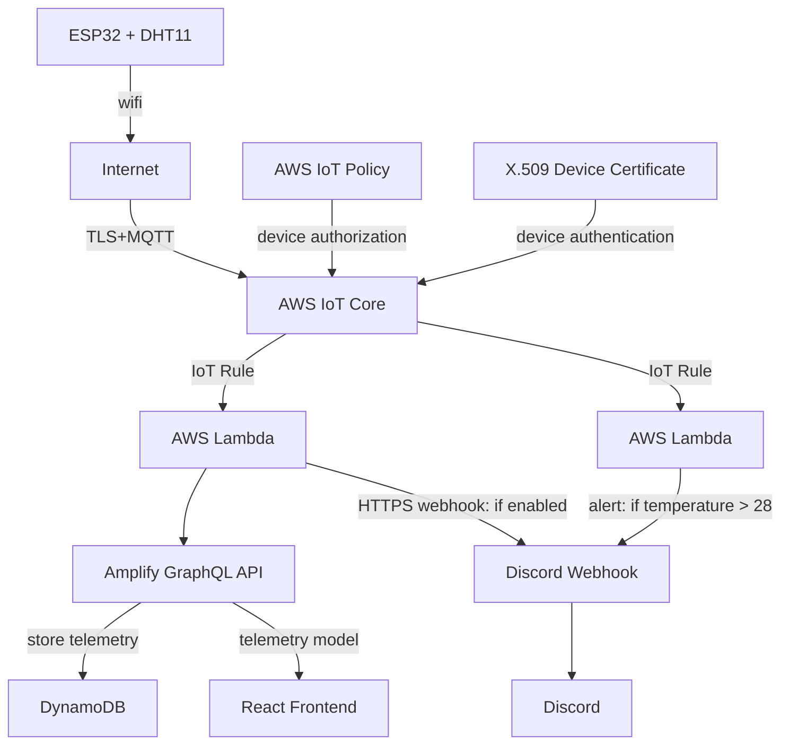

## System Architecture

```mermaid
flowchart TD
    A["ESP32 + DHT11"] --> |wifi| M["Internet"]
    M --> |TLS+MQTT| B["AWS IoT Core"]
    B --> |IoT Rule| D["AWS Lambda"]
    B --> |IoT Rule| E["AWS Lambda"]
    E --> |alert: if temperature > 28|I
    D --> G["Amplify GraphQL API"]
    G --> |store telemetry|H["DynamoDB"]
    D --> |HTTPS webhook: if enabled|I["Discord Webhook"]
    I --> F["Discord"]
    G --> |telemetry model|J["React Frontend"]
    N["AWS IoT Policy"] --> |device authorization|B
    O["X.509 Device Certificate"] --> |device authentication|B
```
